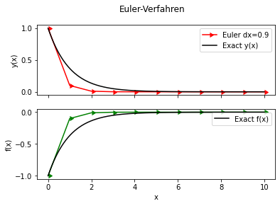
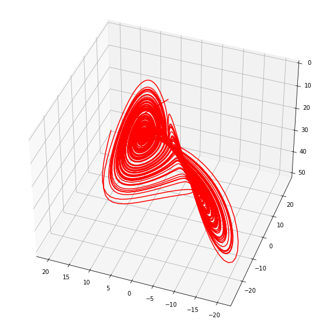
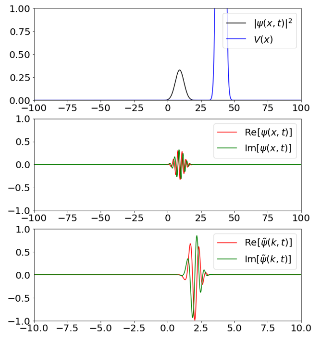
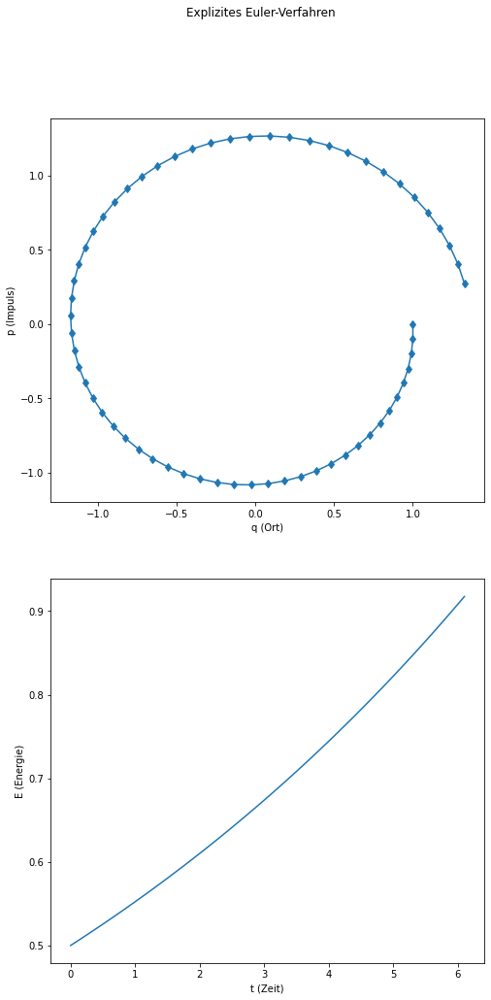

# NMS-Notebooks

## Zerfallsgleichung mit Einschritt-Verfahren

## Euler-Verfahren für System von gekoppelten nichtlinearen Differentialgleichungen

## Split-Operator-Methode für zeitabhängige Schrödingergleichung

## Stabilität 

